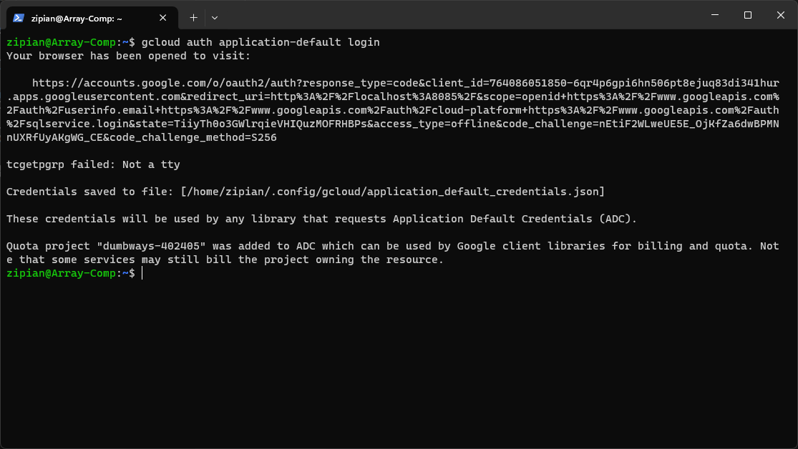
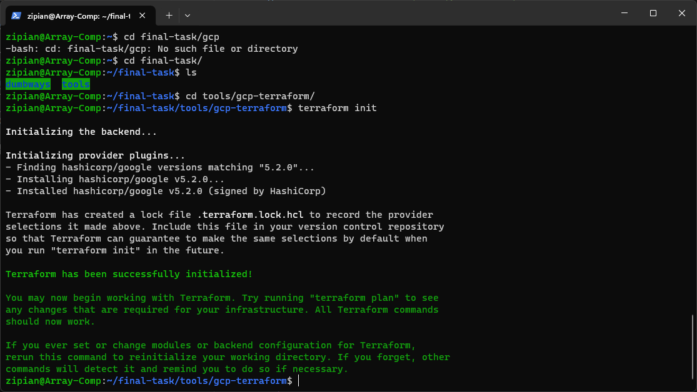
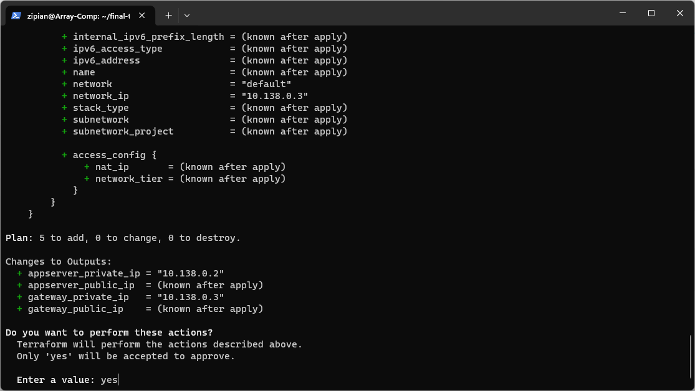
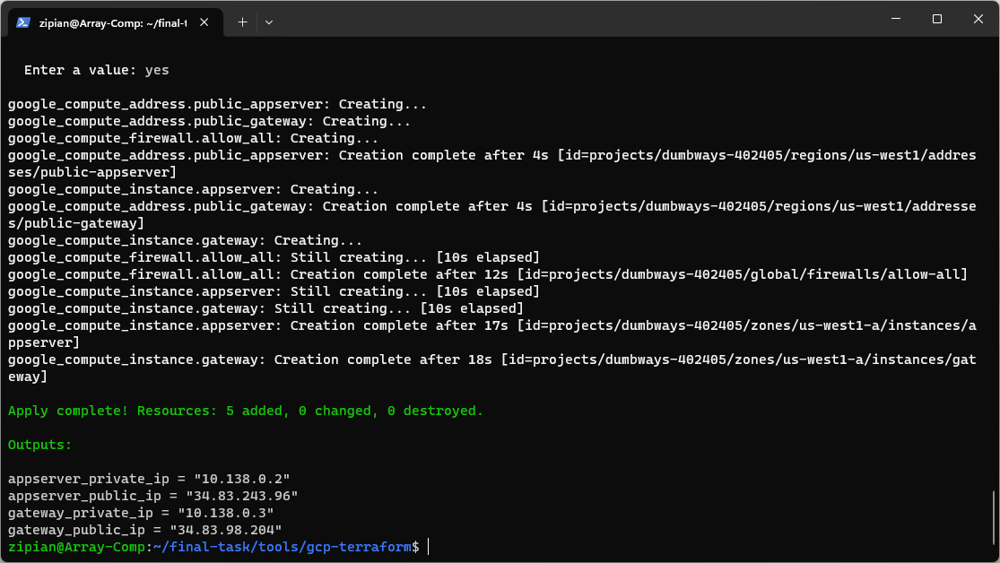
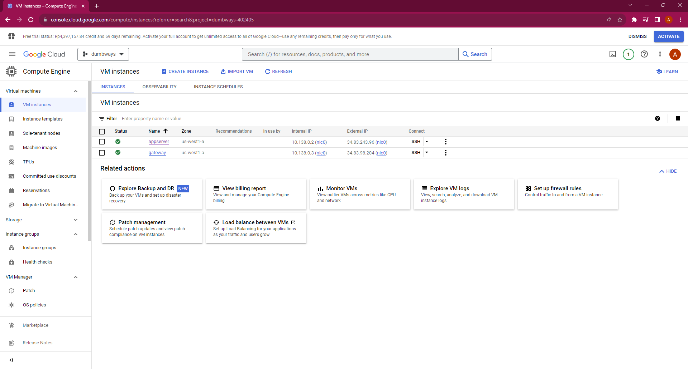

# 1. Provisioning

## 1. Install gcloud CLI

1. Update packages
```bash
sudo apt update
```

2. Install packages pendukung
```bash
sudo apt -y install apt-transport-https ca-certificates gnupg curl sudo
```

3. Menambah distribution URI
```bash
echo "deb https://packages.cloud.google.com/apt cloud-sdk main" | sudo tee -a /etc/apt/sources.list.d/google-cloud-sdk.list
```

4. Import gcloud public key
```bash
curl https://packages.cloud.google.com/apt/doc/apt-key.gpg | sudo apt-key --keyring /usr/share/keyrings/cloud.google.gpg add -
```

5. Install gcloud CLI
```bash
sudo apt update && sudo apt install google-cloud-cli
```

## 2. Create VM Google Cloud using Terraform

1. Login google dan jadikan sebagai default
```bash
gcloud auth application-default login
```


2. Buat file `main.tf` sebagai configurasi nya
```bash
terraform {
  required_providers {
    google = {
      source = "hashicorp/google"
      version = "5.2.0"
    }
  }
}

provider "google" {
  project     = "dumbways-402405"
  region      = "us-west1" #Low CO2
}

resource "google_compute_instance" "appserver" {
  name         = "appserver"
  machine_type = "e2-standard-4" #4 vCPU (2 core), 16 GB memory
  zone         = "us-west1-a"
  
  boot_disk {
    initialize_params {
      image = "ubuntu-os-cloud/ubuntu-2004-lts"
    }
  }
  
  network_interface {
    network = "default"
    network_ip = "10.138.0.2" #subnet 10.138.0.0/20
    access_config {
      nat_ip = google_compute_address.public_appserver.address
    }
  }

  metadata = {
    ssh-keys = "alfiansy:${file("/mnt/c/Users/zVersion/.ssh/gcp.pub")}"
  }
}

resource "google_compute_instance" "gateway" {
  name         = "gateway"
  machine_type = "e2-standard-2" #2 vCPU (1 core), 8 GB memory
  zone         = "us-west1-a"
  
  boot_disk {
    initialize_params {
      image = "ubuntu-os-cloud/ubuntu-2004-lts"
    }
  }
  
  network_interface {
    network = "default"
    network_ip = "10.138.0.3" #subnet 10.138.0.0/20
    access_config {
      nat_ip = google_compute_address.public_gateway.address
    }
  }

  metadata = {
    ssh-keys = "alfiansy:${file("/mnt/c/Users/zVersion/.ssh/gcp.pub")}"
  }
}

resource "google_compute_address" "public_appserver" {
  name = "public-appserver"
}

resource "google_compute_address" "public_gateway" {
  name = "public-gateway"
}

resource "google_compute_firewall" "allow_all" {
  name    = "allow-all"
  network = "default"

  allow {
    protocol = "all"
  }

  source_ranges = ["0.0.0.0/0"]
}

output "appserver_private_ip" {
  value = google_compute_instance.appserver.network_interface.0.network_ip
}

output "gateway_private_ip" {
  value = google_compute_instance.gateway.network_interface.0.network_ip
}

output "appserver_public_ip" {
  value = google_compute_address.public_appserver.address
}

output "gateway_public_ip" {
  value = google_compute_address.public_gateway.address
}
```

3. Inisialisasi config terraformnya
```bash
terraform init
```


4. Lalu aplikasikan config nya guna membuat vm di gcp, lalu konfirmasi dengan `yes`
```bash
terraform apply
```


5. Setelah berhasil maka akan tampil output berupa ip vm sesusai dengan config yang kita buat diatas


6. Lakukan pengecekan juga pada google cloud console nya via browser


## 3. 


[**Back**](../README.md)